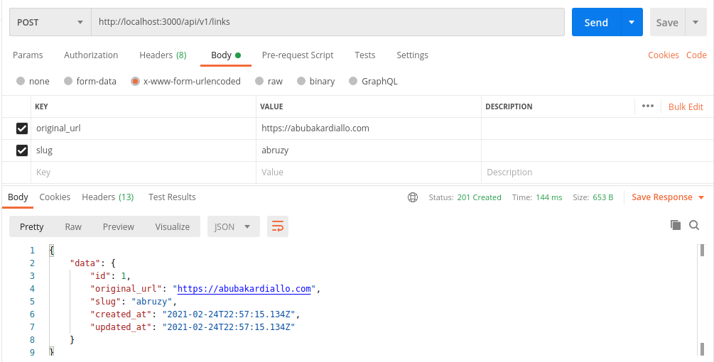

<!-- PROJECT SHIELDS -->
<!--
*** I'm using markdown "reference style" links for readability.
*** Reference links are enclosed in brackets [ ] instead of parentheses ( ).
*** See the bottom of this document for the declaration of the reference variables
*** for contributors-url, forks-url, etc. This is an optional, concise syntax you may use.
*** https://www.markdownguide.org/basic-syntax/#reference-style-links
-->

[![Contributors][contributors-shield]][contributors-url]
[![Forks][forks-shield]][forks-url]
[![Stargazers][stars-shield]][stars-url]
[![Issues][issues-shield]][issues-url]
[![MIT License][license-shield]][license-url]

<!-- PROJECT LOGO -->
<br />
<p align="center">
  <h3 align="center">URL Shortener</h3>
  <p align="center">Link to live Version of the <a href="#">app</a></p>
  <p align="center">
  This app helps you shortens your long urls
    <br />
    <a href="https://github.com/abruzy/url-shortener/blob/develop/README.md"><strong>Explore the docs �</strong></a>
    <br />
    <br />
  </p>
</p>

<!-- TABLE OF CONTENTS -->

## Table of Contents

- [About the Project](#about-the-project)
  - [Built With](#built-with)
- [Getting Started](#getting-started)
  - [Prerequisites](#prerequisites)
  - [Installation](#installation)
- [Usage](#usage)
- [Roadmap](#roadmap)
- [Contributing](#contributing)
- [License](#license)
- [Contact](#contact)
- [Acknowledgements](#acknowledgements)

<!-- ABOUT THE PROJECT -->

## About The Project

There are several services and some platforms providing URL shortener. Sometimes they call it link shortener, URL shrinker, Link compressor, vanity URL creator, but they all work the same:

- You enter a URL and the output is a short URL.
- You can use that short URL for example for social media sharing.
- When users click on the short link they are getting redirected to your origin URL.
- You can see stats about clicks on your links.

Some services provide a Custom URL shortener, so that you can register your domain and use that domain to shrink your URLs. Using your domain can create more trust for the ones who see the link.

The benefit of using such a service is that you will be able to track down clicks on links you are sharing on social media. The disadvantage is that you rely on third party services and if you can see the statistics of your clicks, the service will also do.

That's why we want to implement our Link shortener in Ruby On Rails.

### Built With

This progam was made using this technologies

- [Ruby](https://www.ruby-lang.org/en/)
- [Rails](https://rubyonrails.org/)
- [PostgreSQL](https://www.postgresql.org/)

<!-- GETTING STARTED -->

## Getting Started

To get a local copy up and running follow these simple example steps.

### Prerequisites

- Ruby
  You can easily install Ruby on your Linux computer by using [Homebrew](https://docs.brew.sh/) and [Chruby](https://github.com/postmodern/chruby)

```sh
brew install chruby
brew install ruby-install
ruby-install ruby
```

- Rails
  You can easily install Rails by using [the odin project's giude](https://www.theodinproject.com/courses/web-development-101/lessons/your-facebook-clonelication) or directly from the [rails site](https://rubyonrails.org/)

```sh
  gem install rails
```

### Installation

<!-- 1. Get a free API Key at [https://example.com](https://example.com) -->

1. Clone the repo

```sh
git clone git@github.com:abruzy/url-shortener.git
```

2. The next thing is to change directory folder

```sh
cd url-shortener
```

3. The next step is to install our dependencies by running the following command below

```sh
bundle install
```

```sh
yarn install
```

4. create a file called '.env' in your root directory and copy the field below and paste it inside that .env file

NB: please replace, for example 'yourpassword' to 'abruzy9463' with the appropiate details

```sh
DATABASE_NAME='yourdatabasename'
TEST_DATABASE_NAME='yourtestdatabasename'
DATABASE_USER='yourpostgresuser'
DATABASE_PASSWORD='yourpassword'
DATABASE_HOST='yourpostgreshost'
DATABASE_PORT='yourportnumber'
```

5. The next step is to run the command below

NB: please make sure you have pgadmin installed on your machine

```sh
rails db:create
```

6. The next step is to migrate to our database by running the following command

```sh
rails db:migrate
```

7. Voila!!, you did a great job but alas, we need to complete the whole step by actually starting our server by running the command below

```sh
rails s
```

8. Now to view the app, we need to visit this url below and you can actually see this in your terminal when you start the server

```sh
http://localhost:3000/
```

## To run test

```sh
rspec
```

<!-- USAGE EXAMPLES -->

## Usage

To create a short link, do the following

Open your POST Man

NB: Make sure it is set to POST



- http://localhost:3000/api/v1/links

- then set your params accroding to the screenshot above!

- After creating the short url, you can confirm using the instructions below

Open your chrome browser and do this

      http://localhost:3000/api/v1/:slug

where there's :slug, please replace it with the one you input when creating it and hit enter

This will take you back to your original site and voila, that's it

<!-- LIVE VERSION -->

<!-- ROADMAP -->

## Roadmap

See the [open issues](https://github.com/abruzy/url-shortener/issues) for a list of proposed features (and known issues).

<!-- CONTRIBUTING -->

## Contributing

Contributions are what make the open source community such an amazing place to be learn, inspire, and create. Any contributions you make are **greatly appreciated**.

1. Fork the Project
2. Create your Feature Branch (`git checkout -b feature/AmazingFeature`)
3. Commit your Changes (`git commit -m 'Add some AmazingFeature'`)
4. Push to the Branch (`git push origin feature/AmazingFeature`)
5. Open a Pull Request

<!-- LICENSE -->

## License

Distributed under the MIT License. See `LICENSE` for more information.

<!-- CONTACT -->

## Contact

- Abubarkar Diallo: [Github](https://github.com/abruzy)

Project Link: [https://github.com/abruzy/url-shortener](https://github.com/abruzy/url-shortener)

<!-- ACKNOWLEDGEMENTS -->

<!-- MARKDOWN LINKS & IMAGES -->
<!-- https://www.markdownguide.org/basic-syntax/#reference-style-links -->

[contributors-shield]: https://img.shields.io/github/contributors/abruzy/facebook-clone
[contributors-url]: https://github.com/abruzy/url-shortener/graphs/contributors
[forks-shield]: https://img.shields.io/github/forks/abruzy/url-shortener
[forks-url]: https://github.com/abruzy/url-shortener/network/members
[stars-shield]: https://img.shields.io/github/stars/abruzy/facebook-clone
[stars-url]: https://github.com/abruzy/url-shortener/stargazers
[issues-shield]: https://img.shields.io/github/issues/abruzy/facebook-clone
[issues-url]: https://github.com/abruzy/url-shortener/issues
[license-shield]: https://img.shields.io/github/license/abruzy/facebook-clone
[license-url]: https://github.com/abruzy/url-shortener/blob/master/LICENSE.txt
